## 1、Faker

**1. 安装**

```
pip install Faker
```

### **2. 简单使用**

```
>>> from faker import Faker
>>> fake = Faker(locale='zh_CN')
>>> fake.name()
'李洁'
>>> fake.address()
'上海市兴安盟县江北东莞路r座 803484'
```

参数 locale：为生成数据的文化选项（语种），默认为 en_US，只有使用了相关文化，才能生成相对应的随机信息

常见的文化选项：

- zh_CN - Chinese (China Mainland)

- zh_TW - Chinese (China Taiwan)

- en_US - English (United States)

  

### **3. 其他方法**

#### **3.1 地理信息类**

```
city_suffix()：市，县
country()：国家
country_code()：国家编码
district()：区
geo_coordinate()：地理坐标
latitude()：地理坐标(纬度)
longitude()：地理坐标(经度)
postcode()：邮编
province()：省份
address()：详细地址
street_address()：街道地址
street_name()：街道名
street_suffix()：街、路
```

#### **3.2 基础信息类**

```
ssn()：生成身份证号
bs()：随机公司服务名
company()：随机公司名（长）
company_prefix()：随机公司名（短）
company_suffix()：公司性质，如'信息有限公司'
credit_card_expire()：随机信用卡到期日，如'03/30'
credit_card_full()：生成完整信用卡信息
credit_card_number()：信用卡号
credit_card_provider()：信用卡类型
credit_card_security_code()：信用卡安全码
job()：随机职位
first_name_female()：女性名
first_name_male()：男性名
name()：随机生成全名
name_female()：男性全名
name_male()：女性全名
phone_number()：随机生成手机号
phonenumber_prefix()：随机生成手机号段，如139
```

**3.3 邮箱信息类**

```
ascii_company_email()：随机ASCII公司邮箱名
ascii_email()：随机ASCII邮箱：
company_email()：公司邮箱
email()：普通邮箱
safe_email()：安全邮箱
```

**3.4 网络基础信息类**

```
domain_name()：生成域名
domain_word()：域词(即，不包含后缀)
ipv4()：随机IP4地址
ipv6()：随机IP6地址
mac_address()：随机MAC地址
tld()：网址域名后缀(.com,.net.cn,等等，不包括.)
uri()：随机URI地址
uri_extension()：网址文件后缀
uri_page()：网址文件（不包含后缀）
uri_path()：网址文件路径（不包含文件名）
url()：随机URL地址
user_name()：随机用户名
image_url()：随机URL地址
```

**3.5 浏览器信息类**

```
chrome()：随机生成Chrome的浏览器user_agent信息
firefox()：随机生成FireFox的浏览器user_agent信息
internet_explorer()：随机生成IE的浏览器user_agent信息
opera()：随机生成Opera的浏览器user_agent信息
safari()：随机生成Safari的浏览器user_agent信息
linux_platform_token()：随机Linux信息
user_agent()：随机user_agent信息
```

**3.6 数字信息**

```
numerify()：三位随机数字
random_digit()：0~9随机数
random_digit_not_null()：1~9的随机数
random_int()：随机数字，默认0~9999，可以通过设置min,max来设置
random_number()：随机数字，参数digits设置生成的数字位数
pyfloat()：随机Float数字
pyint()：随机Int数字（参考random_int()参数）
pydecimal()：随机Decimal数字（参考pyfloat参数）
```

**3.7 文本加密类**

```
pystr()：随机字符串
random_element()：随机字母
random_letter()：随机字母
paragraph()：随机生成一个段落
paragraphs()：随机生成多个段落
sentence()：随机生成一句话
sentences()：随机生成多句话，与段落类似
text()：随机生成一篇文章
word()：随机生成词语
words()：随机生成多个词语，用法与段落，句子，类似
binary()：随机生成二进制编码
boolean()：True/False
language_code()：随机生成两位语言编码
locale()：随机生成语言/国际 信息
md5()：随机生成MD5
null_boolean()：NULL/True/False
password()：随机生成密码,可选参数：length：密码长度；special_chars：是否能使用特殊字符；digits：是否包含数字；upper_case：是否包含大写字母；lower_case：是否包含小写字母
sha1()：随机SHA1
sha256()：随机SHA256
uuid4()：随机UUID
```

**4. 实战使用**

在数据库建一张表，通过Faker造数据，插入到表中。并且打印Faker造的数据。

```python
import pymysql
from faker import Faker

conn = pymysql.connect(host="114.215.129.166", port=3306, user="nice", password="", db="flask201",
                       charset="utf8")

cursor = conn.cursor()
sql1 = """drop table if exists faker_user"""
sql2 = """
create table faker_user(
pid int primary key auto_increment,
username varchar(20),
password varchar(20),
address varchar(35) 
)
"""
cursor.execute(sql1)
cursor.execute(sql2)
fake = Faker("zh-CN")
for i in range(20):
    sql = """insert into faker_user(username,password,address) 
    values('%s','%s','%s')""" % (fake.name(), fake.password(special_chars=False), fake.address())
    print('姓名:'+fake.name() + '|密码:'+fake.password(special_chars=False) + '|地址:'+fake.address())
    cursor.execute(sql)

conn.commit()
cursor.close()
conn.close()
```

输出的结果如下：

```
姓名:王平|密码:iZqPxLO947|地址:吉林省莉市房山杨路R座 491718
姓名:柏倩|密码:h853B0idne|地址:辽宁省玉华县蓟州永安街g座 205585
姓名:贾俊|密码:UsRtGXAv9o|地址:湖北省石家庄市大兴傅街c座 861094
姓名:梁丹|密码:ke7QZBdBC3|地址:湖南省太原市璧山太原街m座 939225
姓名:丁燕|密码:Ee9Gt9Jh5E|地址:云南省颖县海港梁街A座 403237
姓名:余敏|密码:d2KhMqlen0|地址:江西省晶市城北深圳路E座 683731
姓名:朱冬梅|密码:aGpEzKJZ2a|地址:台湾省建市淄川张家港路F座 443320
姓名:韦小红|密码:ZDZXzsWiJ1|地址:河北省桂荣市朝阳贺街R座 559885
姓名:蓝艳|密码:tvDugIUra3|地址:湖北省西宁市和平李路n座 365745
姓名:黎雪|密码:Is1U1UAu57|地址:香港特别行政区六盘水市六枝特洪街e座 507272
姓名:刘利|密码:8zzbAEowYA|地址:辽宁省巢湖县西夏台北街k座 665328
姓名:董波|密码:q9TGizssrV|地址:台湾省桂芝市长寿大冶路v座 842339
姓名:刘志强|密码:Za9Vzdocki|地址:湖南省梅市门头沟梧州街r座 897061
姓名:涂飞|密码:9JFvmsO0r2|地址:辽宁省金凤市海港曾路z座 577420
姓名:仲秀英|密码:6MJXQ1w6qb|地址:贵州省淑英市朝阳蔡路r座 880809
姓名:赵冬梅|密码:7oUoUrw22Z|地址:湖北省斌市黄浦阜新路f座 635086
姓名:张丽丽|密码:5DnZJhfnnB|地址:香港特别行政区秀芳县高坪李路b座 543520
姓名:徐燕|密码:6WbRXyiY2R|地址:河北省惠州市锡山南宁路T座 266905
姓名:卫帅|密码:0XqEZPbiGZ|地址:贵州省福州县浔阳孙路L座 535933
姓名:李桂英|密码:6hLMsaqSI1|地址:重庆市辽阳市华龙姬街k座 718930
```

### 1、mimesis**


这个库专门用 Python 创建各种假数据，比如一些数据库的测试数据，假 API、Json、XML 等格式数据都可以通过它产生，把假数据整的像真的似得。

**文档在这：**

https://mimesis.readthedocs.io/api.html

而且支持 33 个不同地方的本地语言假数据生成：

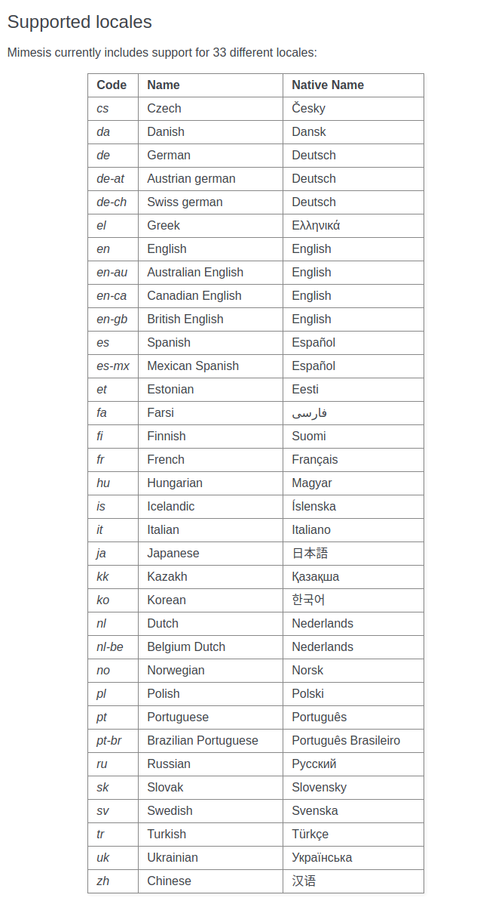

来带你体验一波：

首先导入 mimesis 的 Person 对象：

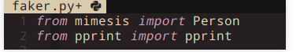

接着定义中文，使用 pprint 将这个对象给打印出来：

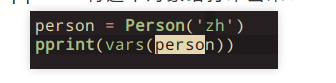

运行一下就可以看到 Person 对象定义的各种假数据了，随便截几张图给你体会一下。


学位、性别、语言：

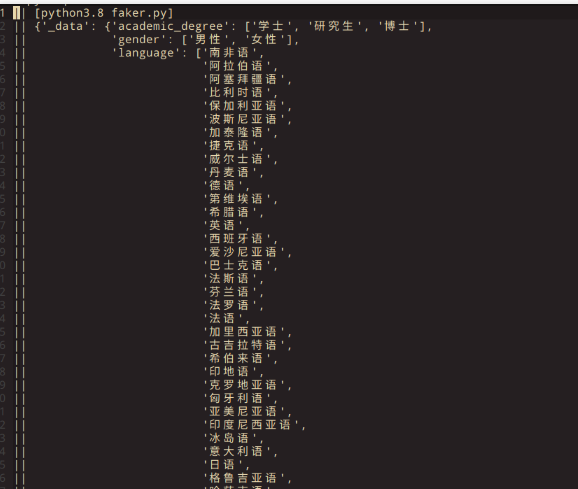

名称：

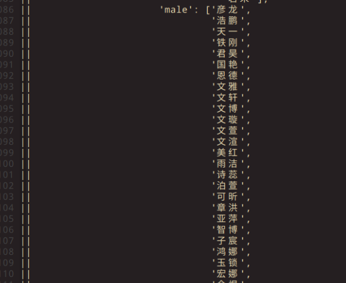


甚至还有**性取向** 和 姓氏：

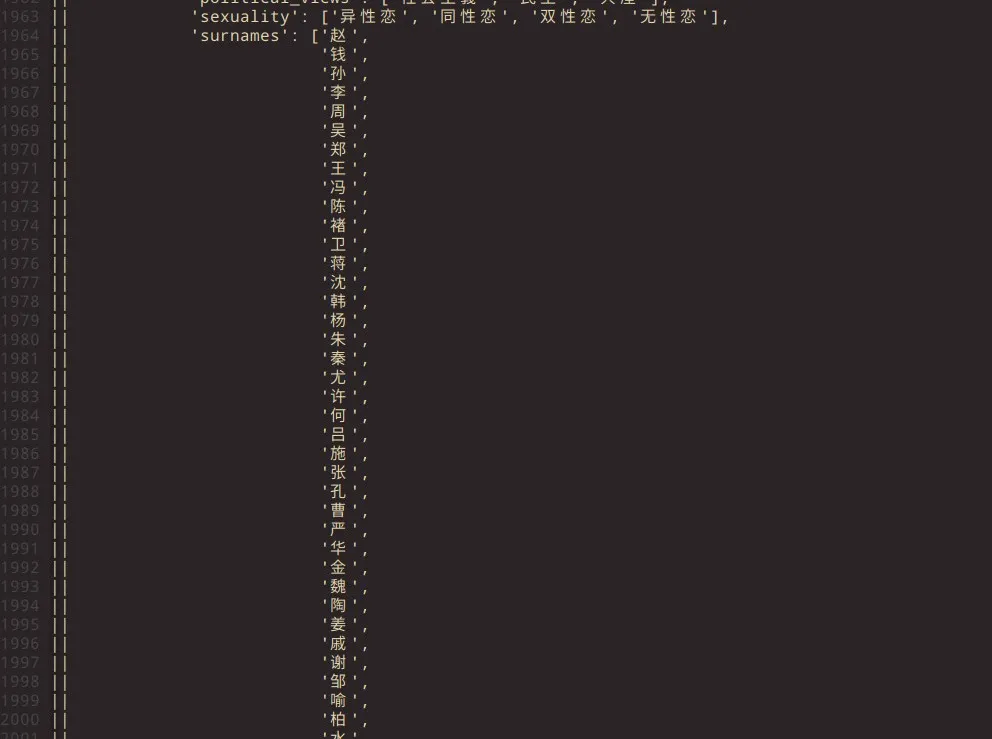

​        

学士学位、就读大学：

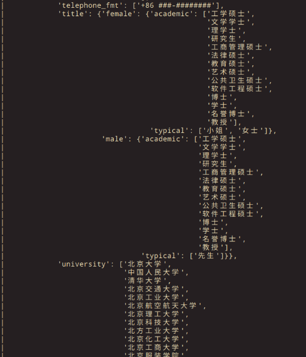


还有很多其它信息就不一一举例了，除了 Person 之外，还有 food、 address、transport、Business 等对象提供的相应假数据。

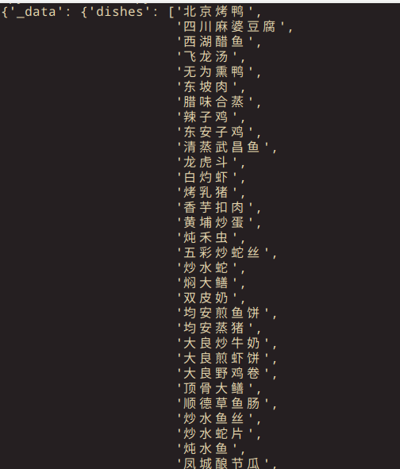


实际上，当你需要用到相关的假数据的时候，你只需要调用相关的对象方法即可：

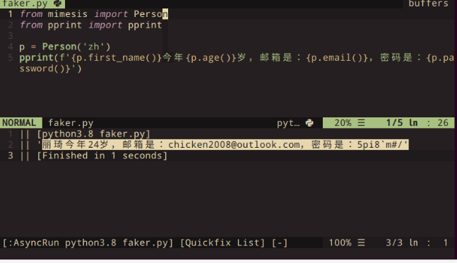


另一个比较方便的就是 API 假数据的创建，你可以先创建一个 py 文件，在里面使用 mimesis.schema 定义要返回的 Json 参数数据格式：

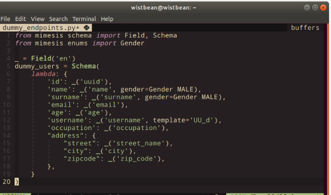


接着在你需要返回 API 的方法中调用它即可：

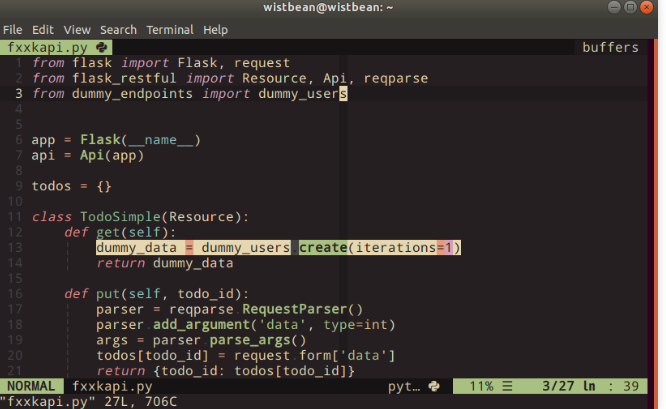


这样调用这个接口你就可以得到相关的假数据啦：

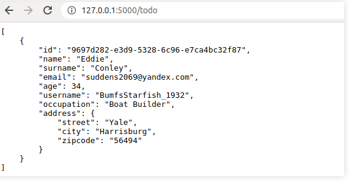


### **2、fake2db**

**代码在这：**

https://github.com/emirozer/fake2db

另一个常需要用到假数据的就是数据库了，fake2db 这个库可以给数据库填充假数据，它可以支持我们常用到的数据库，比如 MySQL、Redis、Mongodb、Sqlite 等。


安装完 fake2db 之后，你就可以使用它的命令来生成假数据了：

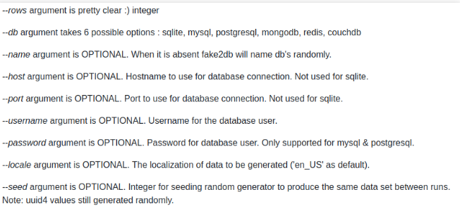

比如你要创建一个 Sqlite，填充 10 条假数据就可以这样：

> fake2db --rows 10 --db sqlite

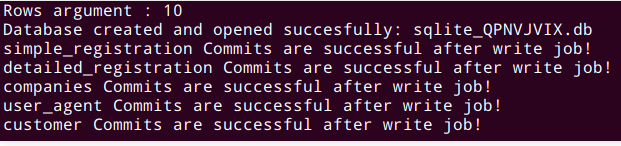


可以看到，这里帮我们创建了 sqlite_QPNVJVIX.db， 并且生成了多张数据表，我们进去看一下：

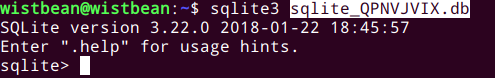


查询一下 user_agent 表中的数据：

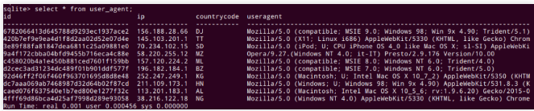

可以看到这里有 10 条假 user_agent 数据。


注册信息：

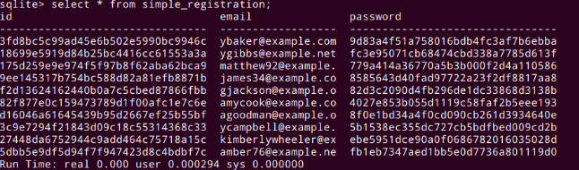


你要多少数据都可以，只要把刚刚的命令中的 --rows 参数设置大一点就可以了。


可能有些数据表的字段你想自己定义，那么可以在 fake2db 的 custom.py 中先定义好字段参数：

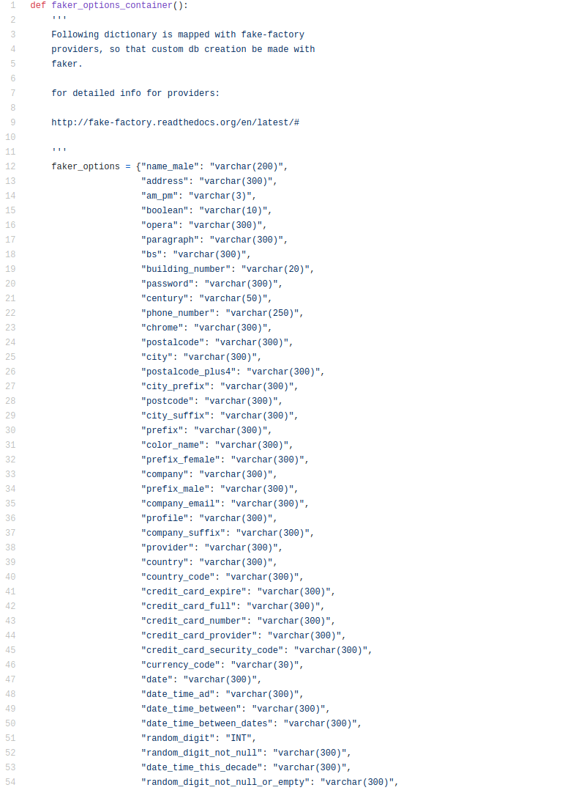


比如我想生成一张含有 user_name、password、email、date 的 Sqlite 数据表，然后往里填充 100 条假数据，就可以这样：

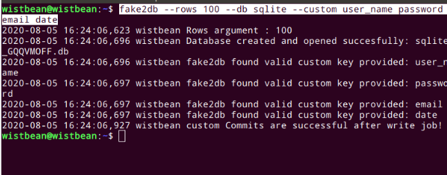


这里使用 --custom 将你要自定义的字段参数传进来就可以了，这时候生成的表数据就是你定义的样子：

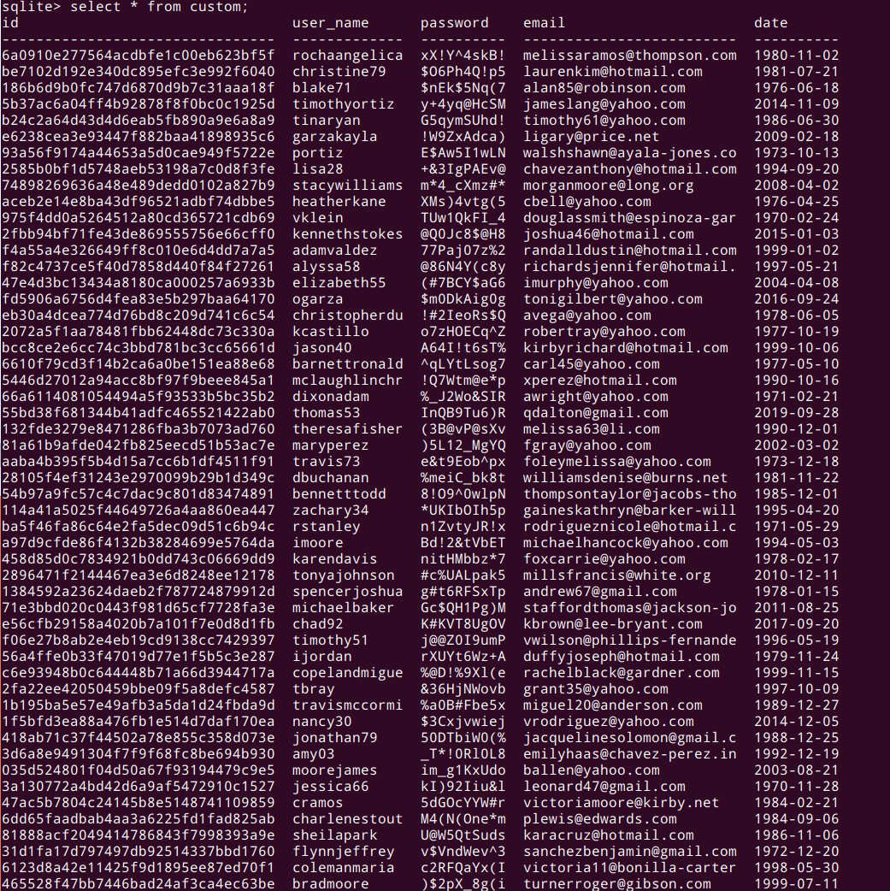


以后需要测试数据再发不用发愁了。