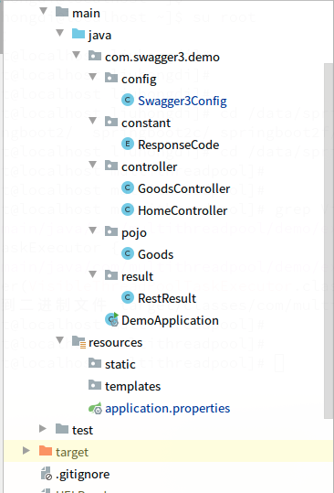
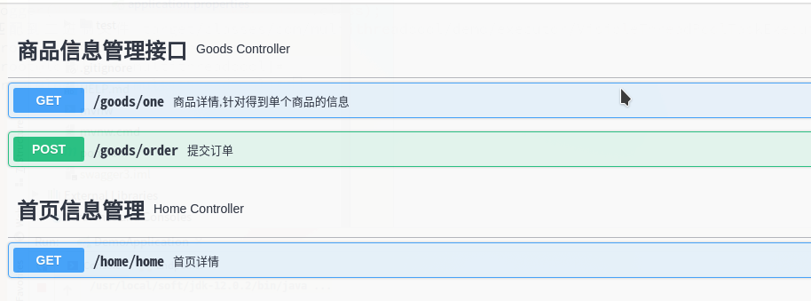
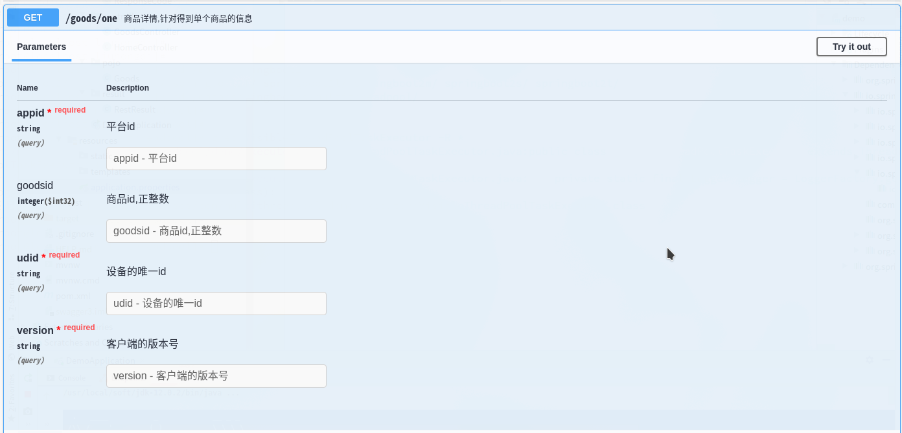
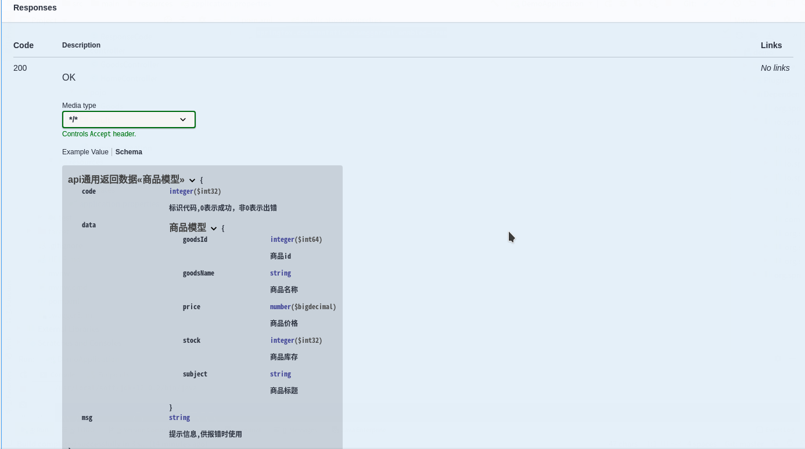

## 一，什么是swagger?

1, Swagger 是一个规范和完整的文档框架，

  用于生成、描述、调用和可视化 RESTful 风格的 Web 服务文档

  官方网站:

```
https://swagger.io/
```

 

2，使用swagger要注意的地方:

   在生产环境中必须关闭swagger,

   它本身只用于前后端工程师之间的沟通,

   可以专门使用一台内部服务器来展示ui供访问,

   即使在这上面要做好安全措施

 

3, 因为swagger3.0.0已发布，本文使用了最新版

   如果有还在用2.x版本的请参考时注意区分

 

说明：刘宏缔的架构森林是一个专注架构的博客，地址：https://www.cnblogs.com/architectforest

​     对应的源码可以访问这里获取： https://github.com/liuhongdi/

说明：作者:刘宏缔 邮箱: 371125307@qq.com

 

## 二，演示项目的相关信息

1,项目地址

```
https://github.com/liuhongdi/swagger3
```

 

2,项目功能说明

 演示了使用swagger3.0.0生成接口站的文档，

 包括：通用的全局参数,

​      响应时各种状态的返回

​      响应的封装后的result格式数据

​      

3,项目结构:如图:



 

 

 

## 三，配置文件说明

1,pom.xml

```xml
<dependency>
    <groupId>io.springfox</groupId>
    <artifactId>springfox-boot-starter</artifactId>
    <version>3.0.0</version>
</dependency>
```

说明：用springfox-boot-starter来引入swagger

 

2,application.properties

```
springfox.documentation.swagger-ui.enabled=true
```

说明：在生产环境中要设置swagger-ui的enabled值为false,

用来关闭文档的显示

 

## 四，java文件说明:

1,Swagger3Config.java

```java
@EnableOpenApi
@Configuration
public class Swagger3Config implements WebMvcConfigurer {

    @Bean
    public Docket createRestApi() {
        //返回文档摘要信息
        return new Docket(DocumentationType.OAS_30)
                .apiInfo(apiInfo())
                .select()
                //.apis(RequestHandlerSelectors.withMethodAnnotation(ApiOperation.class))
                .apis(RequestHandlerSelectors.withMethodAnnotation(Operation.class))
                .paths(PathSelectors.any())
                .build()
                .globalRequestParameters(getGlobalRequestParameters())
                .globalResponses(HttpMethod.GET, getGlobalResonseMessage())
                .globalResponses(HttpMethod.POST, getGlobalResonseMessage());
    }

    //生成接口信息，包括标题、联系人等
    private ApiInfo apiInfo() {
        return new ApiInfoBuilder()
                .title("Swagger3接口文档")
                .description("如有疑问，请联系开发工程师老刘。")
                .contact(new Contact("刘宏缔", "https://www.cnblogs.com/architectforest/", "371125307@qq.com"))
                .version("1.0")
                .build();
    }

    //生成全局通用参数
    private List<RequestParameter> getGlobalRequestParameters() {
        List<RequestParameter> parameters = new ArrayList<>();
        parameters.add(new RequestParameterBuilder()
                .name("appid")
                .description("平台id")
                .required(true)
                .in(ParameterType.QUERY)
                .query(q -> q.model(m -> m.scalarModel(ScalarType.STRING)))
                .required(false)
                .build());
        parameters.add(new RequestParameterBuilder()
                .name("udid")
                .description("设备的唯一id")
                .required(true)
                .in(ParameterType.QUERY)
                .query(q -> q.model(m -> m.scalarModel(ScalarType.STRING)))
                .required(false)
                .build());
        parameters.add(new RequestParameterBuilder()
                .name("version")
                .description("客户端的版本号")
                .required(true)
                .in(ParameterType.QUERY)
                .query(q -> q.model(m -> m.scalarModel(ScalarType.STRING)))
                .required(false)
                .build());
         return parameters;
    }

    //生成通用响应信息
    private List<Response> getGlobalResonseMessage() {
        List<Response> responseList = new ArrayList<>();
        responseList.add(new ResponseBuilder().code("404").description("找不到资源").build());
         return responseList;
    }
}
```

说明：生成了全局的参数和通用的响应信息

 

2,RestResult.java

```java
@ApiModel("api通用返回数据")
public class RestResult<T> {

    //uuid,用作唯一标识符，供序列化和反序列化时检测是否一致
    private static final long serialVersionUID = 7498483649536881777L;
    //标识代码，0表示成功，非0表示出错
    @ApiModelProperty("标识代码,0表示成功，非0表示出错")
    private Integer code;

    //提示信息，通常供报错时使用
    @ApiModelProperty("提示信息,供报错时使用")
    private String msg;

    //正常返回时返回的数据
    @ApiModelProperty("返回的数据")
    private T data;

    //constructor
    public RestResult() {
    }

    //constructor
    public RestResult(Integer status, String msg, T data) {
        this.code = status;
        this.msg = msg;
        this.data = data;
    }

    //返回成功数据
    public RestResult success(T data) {
        return new RestResult(ResponseCode.SUCCESS.getCode(), ResponseCode.SUCCESS.getMsg(), data);
    }

    public static RestResult success(Integer code,String msg) {
        return new RestResult(code, msg, null);
    }

    //返回出错数据
    public static RestResult error(ResponseCode code) {
        return new RestResult(code.getCode(), code.getMsg(), null);
    }

    public Integer getCode() {
        return code;
    }
    public void setCode(Integer code) {
        this.code = code;
    }

    public String getMsg() {
        return msg;
    }
    public void setMsg(String msg) {
        this.msg = msg;
    }

    public T getData() {
        return data;
    }
    public void setData(T data) {
        this.data = data;
    }
```

说明：这里要注意使用泛型T,如果只用Object,则swagger不能识别我们所返回的数据的类型说明:

​     其中:ApiModel用于类上面说明功能,

​        ApiModelProperty用于字段上说明功能

​    尤其是getData方法的返回数据类型，要用T，使用工具生成的data类容易出现这种错误，

​    

3,Goods.java

```java
@ApiModel("商品模型")
public class Goods {
    //商品id
    @ApiModelProperty("商品id")
    Long goodsId;
    public Long getGoodsId() {
        return this.goodsId;
    }
    public void setGoodsId(Long goodsId) {
        this.goodsId = goodsId;
    }

    //商品名称
    @ApiModelProperty("商品名称")
    private String goodsName;
    public String getGoodsName() {
        return this.goodsName;
    }
    public void setGoodsName(String goodsName) {
        this.goodsName = goodsName;
    }

    //商品标题
    @ApiModelProperty("商品标题")
    private String subject;
    public String getSubject() {
        return this.subject;
    }
    public void setSubject(String subject) {
        this.subject = subject;
    }

    //商品价格
    @ApiModelProperty("商品价格")
    private BigDecimal price;
    public BigDecimal getPrice() {
        return this.price;
    }
    public void setPrice(BigDecimal price) {
        this.price = price;
    }

    //库存
    @ApiModelProperty("商品库存")
    int stock;
    public int getStock() {
        return this.stock;
    }
    public void setStock(int stock) {
        this.stock = stock;
    }

    public String toString(){
        return " Goods:goodsId=" + goodsId +" goodsName=" + goodsName+" subject=" + subject+" price=" + price+" stock=" + stock;
    }
}
```

 

4,GoodsController.java

```java
@Api(tags = "商品信息管理接口")
@RestController
@RequestMapping("/goods")
public class GoodsController {

    @Operation(summary = "商品详情,针对得到单个商品的信息")
    @GetMapping("/one")
    public RestResult<Goods> one(@Parameter(description = "商品id,正整数") @RequestParam(value="goodsid",required = false,defaultValue = "0") Integer goodsid) {
        Goods goodsone = new Goods();
        goodsone.setGoodsId(3L);
        goodsone.setGoodsName("电子书");
        goodsone.setSubject("学python,学ai");
        goodsone.setPrice(new BigDecimal(60));
        goodsone.setStock(10);
        RestResult res = new RestResult();
        return res.success(goodsone);
    }

    @Operation(summary = "提交订单")
    @PostMapping("/order")
    @ApiImplicitParams({
            @ApiImplicitParam(name="userid",value="用户id",dataTypeClass = Long.class, paramType = "query",example="12345"),
            @ApiImplicitParam(name="goodsid",value="商品id",dataTypeClass = Integer.class, paramType = "query",example="12345"),
            @ApiImplicitParam(name="mobile",value="手机号",dataTypeClass = String.class, paramType = "query",example="13866668888"),
            @ApiImplicitParam(name="comment",value="发货备注",dataTypeClass = String.class, paramType = "query",example="请在情人节当天送到")
    })

    public RestResult<String> order(@ApiIgnore @RequestParam Map<String,String> params) {
        System.out.println(params);
        RestResult res = new RestResult();
        return res.success("success");
    }
}
```

说明：Api用来指定一个controller中的各个接口的通用说明

​    Operation:用来说明一个方法

​    @ApiImplicitParams:用来包含多个包含多个 @ApiImplicitParam，

​    @ApiImplicitParam:用来说明一个请求参数 

​    如果使用@Parameter来做说明，可以直接加到@RequestParam参数之前     

​    @ApiIgnore:用来忽略不必要显示的参数

 

## 五，效果测试

1,访问文档：访问:

```
http://127.0.0.1:8080/swagger-ui/index.html
```

可以看到已有的接口:



 

 

 

2,查看接口的详情：

参数:可以看到我们添加的全局通用参数



 

响应:

