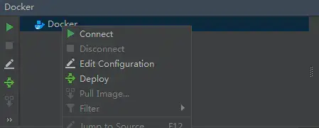

## **一、开发前准备**

**
**

#### 1. Docker的安装可以参考https://docs.docker.com/install/

####  

#### 2. 配置docker远程连接端口

```
  vi /usr/lib/systemd/system/docker.service
```

找到 ExecStart，在最后面添加 -H tcp://0.0.0.0:2375，如下图所示


#### 3. 重启docker

```shell
 systemctl daemon-reload systemctl start docker
```

#### 4. 开放端口

```shell
firewall-cmd --zone=public --add-port=2375/tcp --permanent
```

#### 5. Idea安装插件,重启


#### 6. 连接远程docker

####  (1) 编辑配置



#### (2) 填远程docker地址


####  (3) 连接成功，会列出远程docker容器和镜像


## 二、新建项目

#### 1. 创建springboot项目

项目结构图


#### (1) 配置pom文件

```xml

<?xml version="1.0" encoding="UTF-8"?>
<project xmlns="http://maven.apache.org/POM/4.0.0"
         xmlns:xsi="http://www.w3.org/2001/XMLSchema-instance"
         xsi:schemaLocation="http://maven.apache.org/POM/4.0.0 http://maven.apache.org/xsd/maven-4.0.0.xsd">
    <modelVersion>4.0.0</modelVersion>

    <groupId>docker-demo</groupId>
    <artifactId>com.demo</artifactId>
    <version>1.0-SNAPSHOT</version>
    <parent>
        <groupId>org.springframework.boot</groupId>
        <artifactId>spring-boot-starter-parent</artifactId>
        <version>2.0.2.RELEASE</version>
        <relativePath />
    </parent>

    <properties>
         <project.build.sourceEncoding>UTF-8</project.build.sourceEncoding>
         <project.reporting.outputEncoding>UTF-8</project.reporting.outputEncoding>
         <docker.image.prefix>com.demo</docker.image.prefix>
         <java.version>1.8</java.version>
    </properties>
    <build>
        <plugins>
          <plugin>
            <groupId>org.springframework.boot</groupId>
            <artifactId>spring-boot-maven-plugin</artifactId>
          </plugin>
        <plugin>
           <groupId>com.spotify</groupId>
           <artifactId>docker-maven-plugin</artifactId>
           <version>1.0.0</version>
           <configuration>
              <dockerDirectory>src/main/docker</dockerDirectory>
              <resources>
                <resource>
                    <targetPath>/</targetPath>
                    <directory>${project.build.directory}</directory>
                    <include>${project.build.finalName}.jar</include>
                </resource>
              </resources>
           </configuration>
        </plugin>
        <plugin>
            <artifactId>maven-antrun-plugin</artifactId>
            <executions>
                 <execution>
                     <phase>package</phase>
                    <configuration>
                        <tasks>
                            <copy todir="src/main/docker" file="target/${project.artifactId}-${project.version}.${project.packaging}"></copy>
                        </tasks>
                     </configuration>
                    <goals>
                        <goal>run</goal>
                    </goals>
                    </execution>
            </executions>
        </plugin>

       </plugins>
    </build>
<dependencies>
    <dependency>
        <groupId>org.springframework.boot</groupId>
        <artifactId>spring-boot-starter-web</artifactId>
    </dependency>
    <dependency>
  <groupId>org.springframework.boot</groupId>
        <artifactId>spring-boot-starter-test</artifactId>
        <scope>test</scope>
    </dependency>
    <dependency>
        <groupId>log4j</groupId>
        <artifactId>log4j</artifactId>
        <version>1.2.17</version>
    </dependency>
</dependencies>
</project>
```

#### (2) 在src/main目录下创建docker目录，并创建Dockerfile文件

```dockerfile
FROM openjdk:8-jdk-alpine
ADD *.jar app.jar
ENTRYPOINT ["java","-Djava.security.egd=file:/dev/./urandom","-jar","/app.jar"]
```

#### (3) 在resource目录下创建application.properties文件

```properties
logging.config=classpath:logback.xml
logging.path=/home/developer/app/logs/
server.port=8990
```

#### (4) 创建DockerApplication文件

```java
@SpringBootApplication
public class DockerApplication {
    public static void main(String[] args) {
        SpringApplication.run(DockerApplication.class, args);
    }
}
```

#### (5) 创建DockerController文件

```java
@RestController
public class DockerController {
    static Log log = LogFactory.getLog(DockerController.class);

    @RequestMapping("/")
    public String index() {
        log.info("Hello Docker!");
        return "Hello Docker!";
    }
}
```

#### (6) 增加配置


**命令解释**


**Image tag :** 指定镜像名称和tag，镜像名称为 docker-demo，tag为1.1
**Bind ports :** 绑定宿主机端口到容器内部端口。格式为[宿主机端口]:[容器内部端口]

**Bind mounts :** 将宿主机目录挂到到容器内部目录中。格式为[宿主机目录]:[容器内部目录]。这个springboot项目会将日志打印在容器 

/home/developer/app/logs/ 目录下，将宿主机目录挂载到容器内部目录后，那么日志就会持久化容器外部的宿主机目录中。

#### (7) Maven打包s


#### (8) 运行


先pull基础镜像，然后再打包镜像，并将镜像部署到远程docker运行


这里我们可以看到镜像名称为docker-demo:1.1，docker容器为docker-server

#### (9) 运行成功


