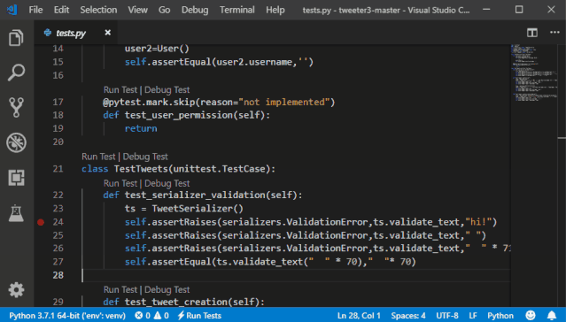
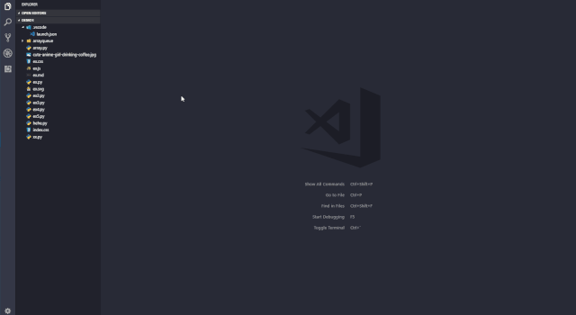
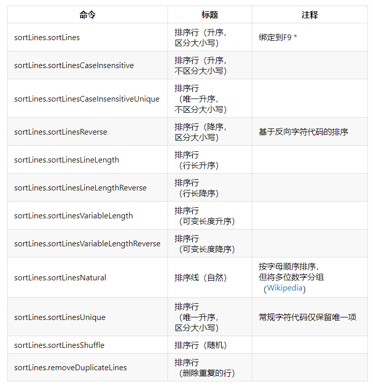
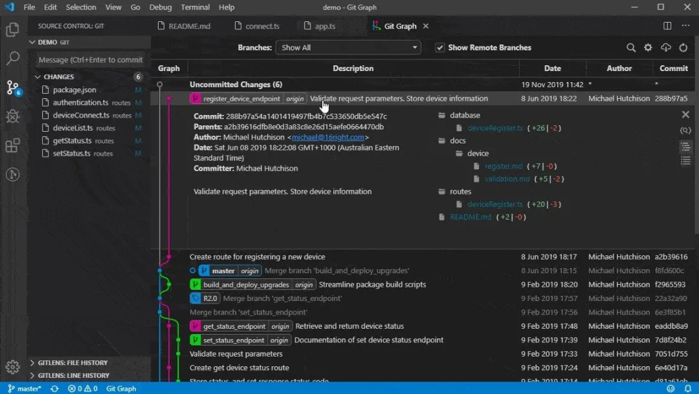
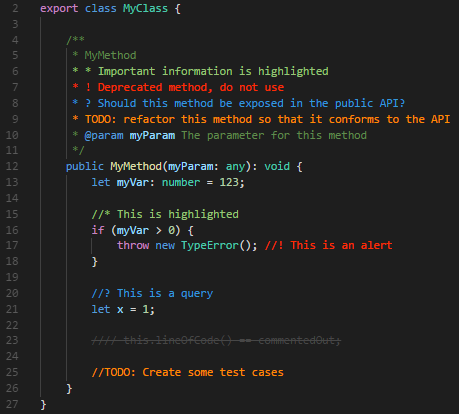
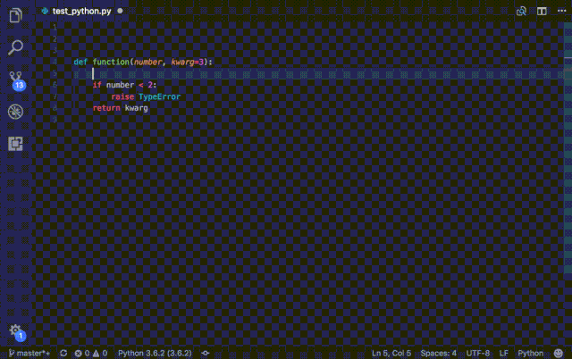
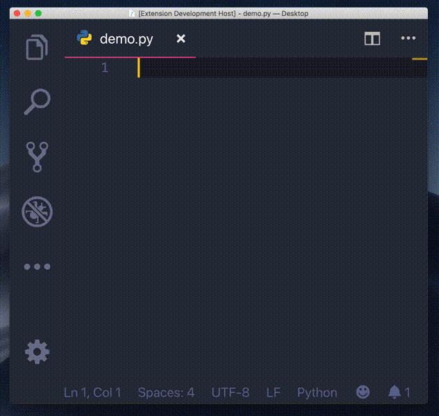

## **1. Python extension for Visual Studio Code**

这个扩展是由微软官方提供的，支持但不仅限于以下功能：

- 通过Pylint或Flake8支持代码检查

- 在VS Code编辑器中调试代码

- IntelliSense支持自动完成，代码导航和格式化。

- 支持Jupyter Notebook，Pytest和Unittest

- 在编辑器中轻松切换Python环境

  

## **2.Python Preview**

这个插件很牛皮，能够实时可视化你的代码结果。

不仅如此，还能为VSCode切换各种主题皮肤。

## **3.Sort lines**

这个扩展很有意思，可以给你按字母大小排序（升序、降序），也可以进行排序+去重。而且还能将所有文本打乱顺序。

做短文本分类的训练，清洗数据集的时候，这个工具大有用处。

## ** **

## **4.Git Graph**

这玩意可是Git神器，堪比Pycharm内的Git管理器。

通过这个扩展，可以清楚地看见当前分支的commit记录和变化，可以通过按钮的方式轻易地创建、切换分支、cherry pick、merge等操作。

对比分支、查看未提交的修改......还有许多可定制的扩展设置。

## **5.Python Snippets**

很多时候，我们用到的代码片段都是类似的，比如for循环、try/catch等等，现在有了这个工具，我们只需要输入命令生成代码片段，然后再进行微调，就能完成功能的开发。

此外，有些时候我们可能会忘记某些内置函数的用法，这个工具也能给你提供示例代码做参考，而不用你再去搜索引擎搜索示例，实在非常方便。

##  

## **6.Better Comments**

这是一个让你能更好地编写注释的工具，它能根据关键词用不同的颜色高亮代码片段。支持以下类型的高亮：

\1. 感叹号 “!” 代码警告。

\2. 问号“?”代表存留疑问。

\3. TODO 代码未来将要进行的操作。

\4. @param 参数

此外，它还支持在设置中自定义需要高亮句子的首部关键词。

## **7.autoDocstring**

这个扩展我应该已经推荐了好多次，能够自动生成函数的注释格式，通过tab键快速切换填充块编写相应的注释。

##  

## **8.Python Indent**

你有没有觉得VSCode里对Python的自动缩进有点不准确？甚至可以用“丑”来形容。每次我都喜欢强行矫正VSCode给我做的自动缩进。

经过一番查阅，我终于找到了能纠正VSCode缩进错误的扩展，它就是Python Indent，看看下面的示例，相信你也会安装它。

